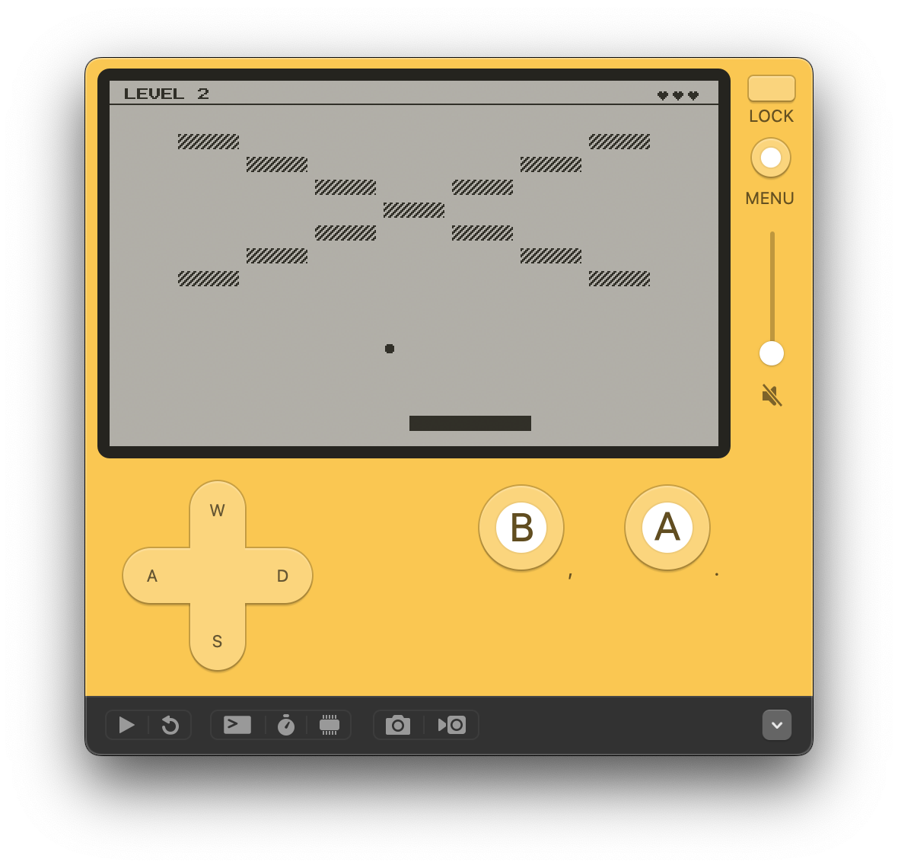

  <h1>PlayOut ☄️</h1>
  
<i>Playdate + Breakout = PlayOut</i>

  

This is a [Breakout] clone written for Playdate to learn [Lua] and the [Playdate
SDK].

  [Breakout]: https://en.wikipedia.org/wiki/Breakout_(video_game)
  [Lua]: https://www.lua.org/
  [Playdate SDK]: https://sdk.play.date/
